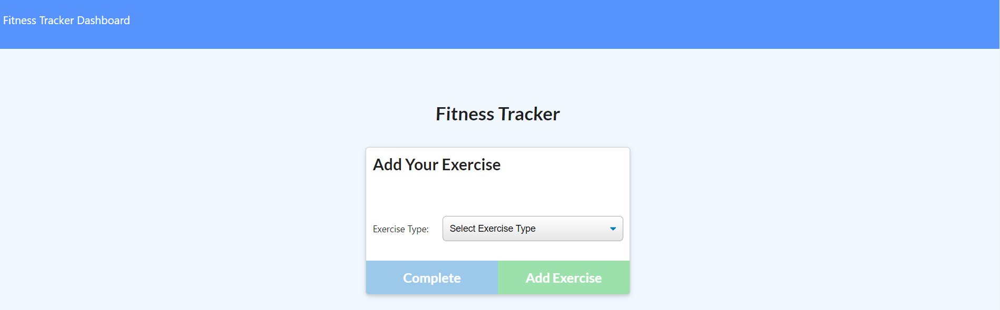
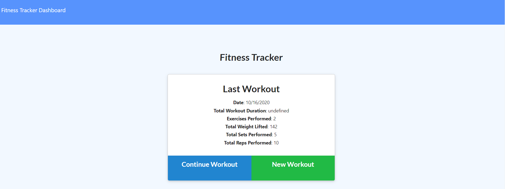

# NoSql-Workout-Tracker
As a user, I want to be able to view create and track daily workouts. I want to be able to log multiple exercises in a workout on a given day. I should also be able to track the name, type, weight, sets, reps, and duration of exercise. If the exercise is a cardio exercise, I should be able to track my distance traveled.

# Landing Page

# New Work Out

# Last Work Out

# Prerequisites
Utilizes MERN stack implementation which is based on Javascript/Node as fullstack web development and requires the latest version of MongoDB Express React and Node.

# Additional prerequisites:
Port set up for MongoDB & Server

# Tools / Technologies used :
* MongoDB
* Mongoose
* HTML
* CSS
* Javascript
* JSON

# demo

# Future Development
* To set up a database which is easily accesible on one click rather then going on a long process.
* The UI can be more appealing with images, icons or signs so that it can be found easily and quickly.